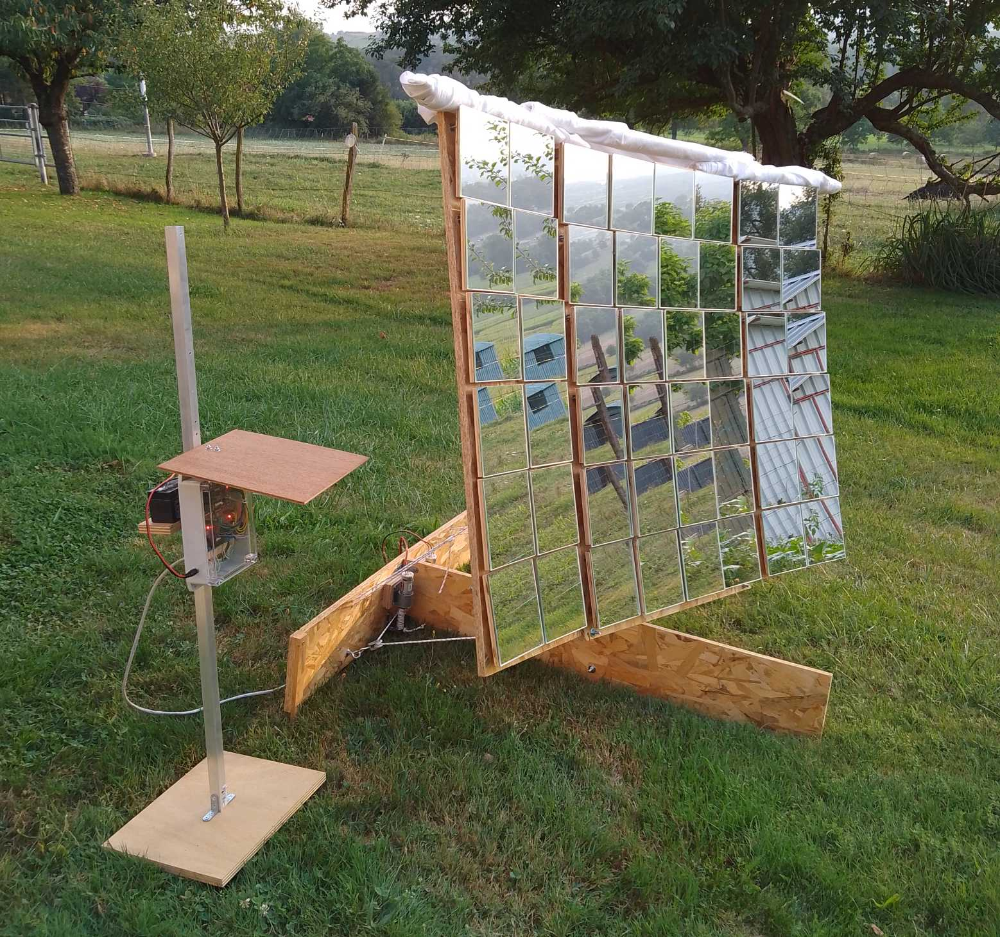

# Solar Concentrator :sunny:

This project is a homemade automated solar concentrator :wrench: :sunny: :mag_right:

It consists of:
* An orientable mirror panel (currently 48 focusing mirrors, totalling 1m²)
* A fixed target (currently a simple concrete oven with a black metal plate and a tempered glass)
* The supervisor: an electronic control device that measures the target, computes and sends commands to the motors

On 26 june 2024, when adding some aluminium foils inside the oven to improve insulation,
the oven temperature has risen to __210°C after 30 minutes__.

The video below shows the concentrator in action on 8 July 2024:
* First half of the video is the assembly (speed x10)
* Second half is the automatic sun tracking for about 7 hours (speed x600)

https://github.com/user-attachments/assets/06e3a9e1-d853-4ddd-b5d8-55cf9d6ecc89

| :warning: This project may harm people or animals in the surroundings |
|---------------------------------------------------------------------- |
| It can __cause permanent blindness, burn skin or ignite objects__ |
| Even when the concentrator is not powered, the sun remains concentrated 48 times in a single small area |
| This point of focus is constantly __moving along a trajectory that is difficult to estimate__ |
| In its current state, it __must be continuously monitored__ and the mirrors must be covered quickly in the event of an anomaly |

## Key points

* Uses only standard, cheap and available components and materials :bricks: :nut_and_bolt:
* Does not require a high precision construction, everything can be made by hand with common tools :straight_ruler: :carpentry_saw:
* Easy to assemble and disassemble :screwdriver:
* Easy to understand and modify :mag_right:
* Open Source :unlock:

Limitations of this version:
* There is no safety layer implemented (see warning above :warning:)
* An initial manual step is required to orientate the panel before starting to track the sun automatically
* Only one panel can be controlled
* Does not work on cloudy days (it is the user's responsibility to remove the clouds from the sky :smile:)

To build this project, some products have been happily "hacked" out of their original use:
* The tempered glass used in the oven comes from an [Ikea shelf](https://www.ikea.com/fr/fr/p/komplement-tablette-en-verre-blanc-80257647/)
* The mirrors are [decorative bathroom mirrors](https://www.bricoman.fr/lot-6-miroirs-adhesif-carre-15x15-cm-1429043.html)
* The motors are low cost [model engines](https://www.gotronic.fr/art-motoreducteur-mfa-950d8101ln-11376.htm)

## Technical breakdown

The project structure reflects the technical breakdown.

Detailed information can be found in the dedicated subfolders :

* [Mechanics :gear:](mechanics/README.md) : 3D models of the parts used in the solar panel
* [Electronics :electric_plug:](electronics/supervisor/README.md) : schematics and layout of the custom supervisor board
* Software :floppy_disk: :
    * [Simulator](software/simulator/README.md) : evaluate the theoretical power received by the target for a given hardware configuration
    * [Motors controller](software/motors_controller/README.md) : Arduino firmware to control motors
    * Supervisor controller : ESP32-CAM firmware based on [Espressif ESP32 framework](https://docs.espressif.com/projects/esp-idf/en/latest/esp32/index.html)
        * [Supervisor component](software/supervisor_controller/components/supervisor/README.md) : supervisor high level logic
        * [Sun tracker](software/supervisor_controller/components/sun_tracker/README.md)
        * [Target detector](software/supervisor_controller/components/sun_tracker/README.md)
        * [Image component](software/supervisor_controller/components/image/README.md)
        * [Web interface](software/supervisor_controller/components/web_interface/README.md)

## Next step

The next step is to control an arbitrary number of panels to obtain several killowatts of power.

This would open up the following possibilities:
* Rapidly boiling a large volume of liquid
* Desalinate or sterilise a large volume of water
* Cook or sterilize a large volume of food
* Melting plastic, metal or glass
* Increasing photovoltaic pannel output power with [concentrated photovoltaics](https://en.wikipedia.org/wiki/Concentrator_photovoltaics)

