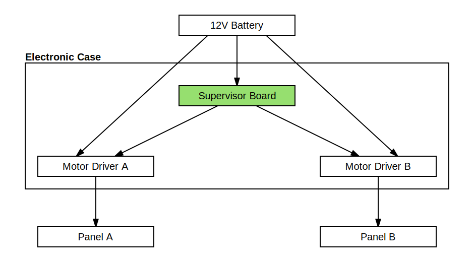

# Solar Concentrator Electronics :electric_plug:

This folder contains the custom electronics designed for the supervisor.

- [Overview](#overview)
- [Supervisor Board](#supervisor-board)
    - [Schematics](#schematics)
    - [Components](#components)
    - [Top layer](#top-layer)
    - [Bottom layer](#bottom-layer)
    - [3D model](#3d-model)
    - [Photos](#photos)
    - [BOM](#bom)
- [Electronic case](#electronic-case)
    - [Photos](#photos)
    - [BOM](#bom)
- [License](#license)

## Overview

A custom board has been designed with [LibrePCB](https://librepcb.org) and produced by [AISLER](https://aisler.net).

It doesn't do anything complicated, just glue things together :
* Allow to plug the ESP32-CAM board
* Allow to plug the Arduino Pro Mini board
* Include connectors for 2 mirror panels
* Include a voltage regulator to convert the battery 12V to 5V
* Include some switchs to power ON/OFF the child boards
* Include a FTDI socket to upload the ESP32-CAM firmware inplace (Arduino has its own FTDI socket)
* Include a minimal voltage converter for the child boards to communicate together

Everything has been assembled in an electronic case with a few external sockets to connect the power supply and the panels.

> [!NOTE]
> The electronics can control two panels but the current software controls only one panel.

## Supervisor Board

### Schematics

### Components

### Top layer

(ground plane is not shown)

### Bottom layer

(ground plane is not shown)

### 3D model

### Photos

### BOM

| Count | Unit Price (€) | Description
| ----- | -------------- | -----------
| 1     | 14.3           | [ESP32-CAM](https://www.gotronic.fr/art-module-esp32-cam-32630.htm)
| 1     | 8.95           | [Arduino Pro Mini](https://www.gotronic.fr/art-carte-dfrduino-pro-mini-dfr0159-19247.htm)
| 2     | 0.6            | [Female socket FH1X6](https://www.gotronic.fr/art-connecteur-fh1x6-22732.htm)
| 2     | 0.65           | [Female socket FH1X7](https://www.gotronic.fr/art-connecteur-fh1x7-22733.htm)
| 2     | 0.75           | [Female socket FH1X8](https://www.gotronic.fr/art-connnecteur-fh1x8-22734.htm)
| 2     | 1.0            | [Female socket FH1X12](https://www.gotronic.fr/art-connecteur-fh1x12-24494.htm)
| 1     | 0.6            | [Male socket HE14](https://www.gotronic.fr/art-connecteur-he14-mh100-4457.htm)
| 1     | 0.5            | [Voltage regulator LM7805](https://www.gotronic.fr/art-l7805cv-1578.htm)
| 1     | 0.2            | [Capacitor 220 nF](https://www.gotronic.fr/art-condensateur-lcc-220-nf-3271.htm)
| 1     | 0.2            | [Capacitor 100 nF](https://www.gotronic.fr/art-condensateur-lcc-100-nf-66.htm)
| 1     | 0.1            | [Resistor 1 ohm 1 W](https://www.gotronic.fr/art-resistance-carbone-1w-1-0-8486-2713.htm)
| 1     | 0.2            | [10 Resistor 10 kohm 0.25 W](https://www.gotronic.fr/art-10-resistances-1-4w-10k-8486-19.htm)
| 3     | 3.3            | [Small switch](https://www.conrad.fr/fr/p/interrupteur-a-levier-250-v-ac-0-15-a-1-x-on-on-611a-permanent-1-pcs-1566114.html)

## Electronic case

### Photos

### BOM

| Count | Unit Price (€) | Description
| ----- | -------------- | -----------
| 1     | 16.9           | [ABS case](https://www.gotronic.fr/art-boitier-abs-etanche-g214cmf-33575.htm)
| 3     | 1.5            | [10 cable M/F](https://www.gotronic.fr/art-pack-de-10-cables-de-connexion-m-f-bbj21-27098.htm)
| 1     | 1.9            | [Female power socket](https://www.gotronic.fr/art-embase-alim-sc215-123.htm)
| 1     | 1.5            | [Male power cable](https://www.gotronic.fr/art-2-cordons-d-alim-5-5-x-2-1-mm-male-22394.htm)
| 2     | 1.2            | [Female DIN socket PB560](https://www.gotronic.fr/art-embase-pb560-4764.htm)
| 2     | 1.0            | [Male DIN plug FM560](https://www.gotronic.fr/art-fiche-din-fm560-4748.htm)
| 2     | 6.5            | [Motor Driver GT1112](https://www.gotronic.fr/art-commande-de-2-moteurs-gt1112-26137.htm)
| 1     | 3.0            | A handful of M3 bolts, nuts, washers and spacers

## License

TODO
