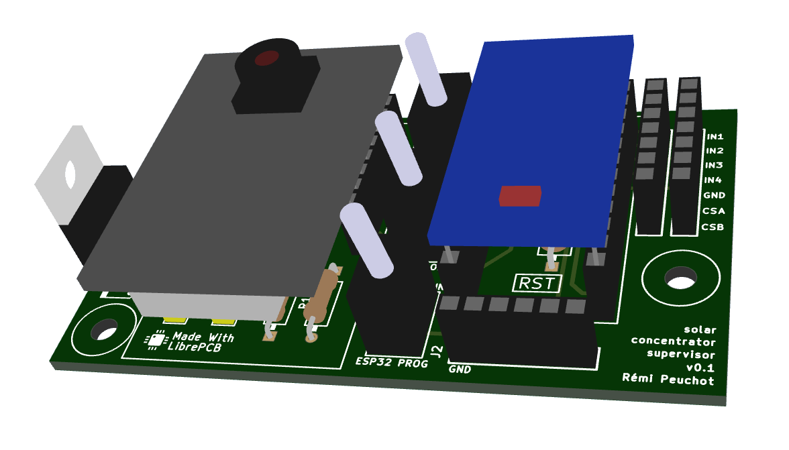

# Solar Concentrator Supervisor Electronics

This folder contains the custom board designed for the supervisor.

It has been designed with [LibrePCB](https://librepcb.org) and produced by [AISLER](https://aisler.net).

It doesn't do anything complicated, just glue things together :
* Allow to plug the ESP32-CAM board
* Allow to plug the Arduino Pro Mini board
* Include connectors for 2 mirror panels
* Include a voltage regulator to convert the battery 12V to 5V
* Include some switchs to power ON/OFF the child boards
* Include a FTDI socket to upload the ESP32-CAM firmware inplace (Arduino has its own FTDI socket)
* Include a minimal voltage converter for the child boards to communicate together

## Overview

## Supervisor Board

### Schematics

### Components

### Top layer

### Bottom layer

### 3D model

### Photo

## License

TODO
