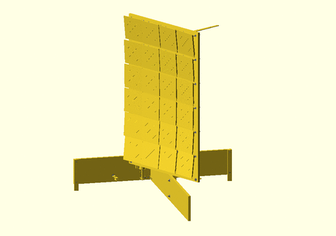

# Solar Concentrator Mechanics

The originality of the mechanical design is to use a simple [cablebot](https://en.wikipedia.org/wiki/Cable_robots) instead
of a traditional 2 axis tracker where each axis has a dedicated motor.
* Advantage: cheaper motors and cheaper mechanical structure can be used.
* Drawback: each axis cannot be controlled independently.

Another originality is the way to precisely set mirror orientation without
requiring high precision mechanics.

| :information_source: You can click on the images below to view them in an online 3D viewer |
|--------------------------------------------------------------------------------------------|

## Solar panel

- __Solar panel__
    - [Stand](#stand)
        - [Stand back board](#stand-back-board)
            - [Motor block](#motor-block)
        - [Stand front board](#stand-front-board)
    - [Panel frame](#panel-frame)
        - [Panel horizontal axis](#panel-horizontal-axis)
        - [Panel vertical axis](#panel-vertical-axis)
    - [Panel board](#panel-board)
        - [Mirror holder](#mirror-holder)

| Assembled | Exploded |
| --------- | -------- |
| TODO | TODO |

## Stand

- [Solar panel](#solar-panel)
    - __Stand__
        - [Stand back board](#stand-back-board)
            - [Motor block](#motor-block)
        - [Stand front board](#stand-front-board)
    - [Panel frame](#panel-frame)
        - [Panel horizontal axis](#panel-horizontal-axis)
        - [Panel vertical axis](#panel-vertical-axis)
    - [Panel board](#panel-board)
        - [Mirror holder](#mirror-holder)

| Assembled | Exploded |
| --------- | -------- |
|  |  |

## Stand back board

- [Solar panel](#solar-panel)
    - [Stand](#stand)
        - __Stand back board__
            - [Motor block](#motor-block)
        - [Stand front board](#stand-front-board)
    - [Panel frame](#panel-frame)
        - [Panel horizontal axis](#panel-horizontal-axis)
        - [Panel vertical axis](#panel-vertical-axis)
    - [Panel board](#panel-board)
        - [Mirror holder](#mirror-holder)

| Assembled | Exploded |
| --------- | -------- |
|  |  |

## Motor block

- [Solar panel](#solar-panel)
    - [Stand](#stand)
        - [Stand back board](#stand-back-board)
            - __Motor block__
        - [Stand front board](#stand-front-board)
    - [Panel frame](#panel-frame)
        - [Panel horizontal axis](#panel-horizontal-axis)
        - [Panel vertical axis](#panel-vertical-axis)
    - [Panel board](#panel-board)
        - [Mirror holder](#mirror-holder)

| Assembled | Exploded |
| --------- | -------- |
| TODO | TODO |

## Stand front board

- [Solar panel](#solar-panel)
    - [Stand](#stand)
        - [Stand back board](#stand-back-board)
            - [Motor block](#motor-block)
        - __Stand front board__
    - [Panel frame](#panel-frame)
        - [Panel horizontal axis](#panel-horizontal-axis)
        - [Panel vertical axis](#panel-vertical-axis)
    - [Panel board](#panel-board)
        - [Mirror holder](#mirror-holder)

| Assembled | Exploded |
| --------- | -------- |
|  | TODO |

## Panel frame
