# Solar Concentrator Mechanics :gear:

This folder contains the 3D models of the parts used in the solar panel.

- [Overview](#overview)
- [Solar panel](#solar-panel)
    - [Stand](#stand)
        - [Stand back board](#stand-back-board)
            - [Motor block](#motor-block)
        - [Stand front board](#stand-front-board)
    - [Panel frame](#panel-frame)
        - [Panel horizontal axis](#panel-horizontal-axis)
        - [Panel vertical axis](#panel-vertical-axis)
    - [Panel board](#panel-board)
- [License](#license)

## Overview

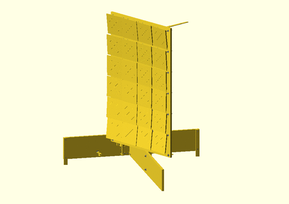

The originality of the mechanical design is to use a simple [cablebot](https://en.wikipedia.org/wiki/Cable_robots) instead
of a traditional 2 axis tracker where each axis has a its own motor.
* Advantage: cheaper motors and cheaper mechanical structure can be used.
* Drawback: each axis cannot be controlled independently.

Another originality is the way in which each mirror orientation
can be precisely adjusted without the need for high-precision mechanics.

The mechanical parts have been modeled with [OpenSCAD](https://openscad.org/).

The documented model contains a single panel board with 24 mirrors.
Two 'wings' have been added to the sides to add 24 mirrors but are not documented here
(see the photo and video in the top-level README).

> [!TIP]
> __You can click on the images below to view them in an online 3D viewer.__

## Solar panel

> [!NOTE]
> The cable is not modeled because I couldn't find an easy way to do it with OpenSCAD.
>
> Each cable is actually wrapped around the motor axis, then passed through the pulley
> and tied to a fixed ring in the corner of the panel
> (see the photo and video in the top-level README).

| Assembled | Exploded |
| --------- | -------- |
| [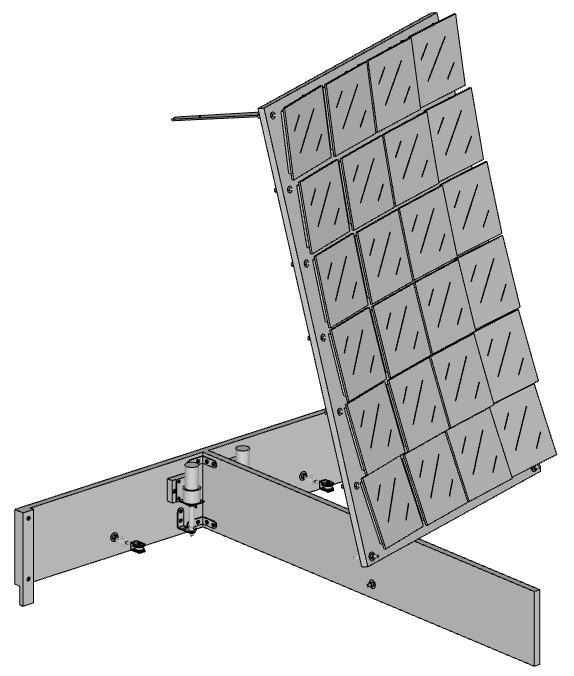](https://remipch.github.io/test_website/view_3d.html?model=temp) | [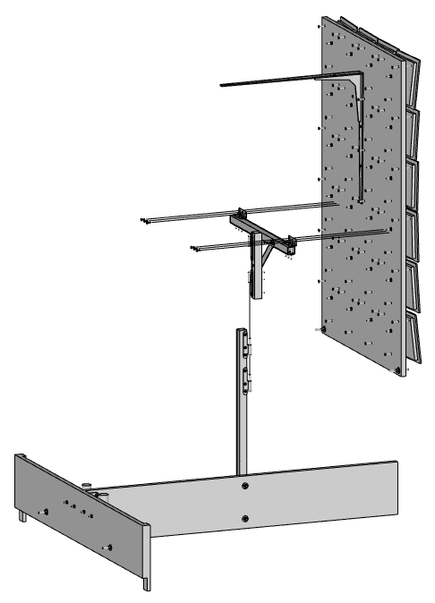](https://remipch.github.io/test_website/view_3d.html?model=temp)

A 'solar panel' consists of the following parts:

| Count | Description |
| ----- | ----------- |
| 1 | [Stand](#stand)
| 1 | [Panel frame](#panel-frame)
| 1 | [Panel board](#panel-board)
| 6 | Wood screw D4mm L15mm
| 2 | Cable (not shown in model)
| 1 | Counterweight 3kg (not shown in model)

### Stand

| Assembled | Exploded |
| --------- | -------- |
| [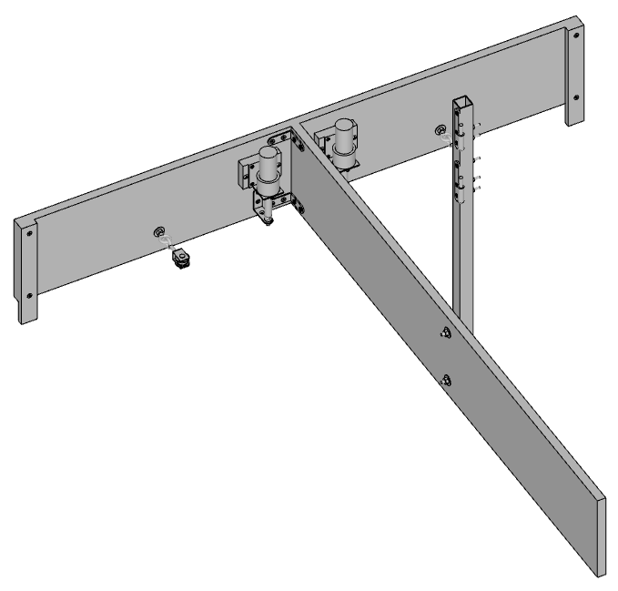](https://remipch.github.io/test_website/view_3d.html?model=temp) | [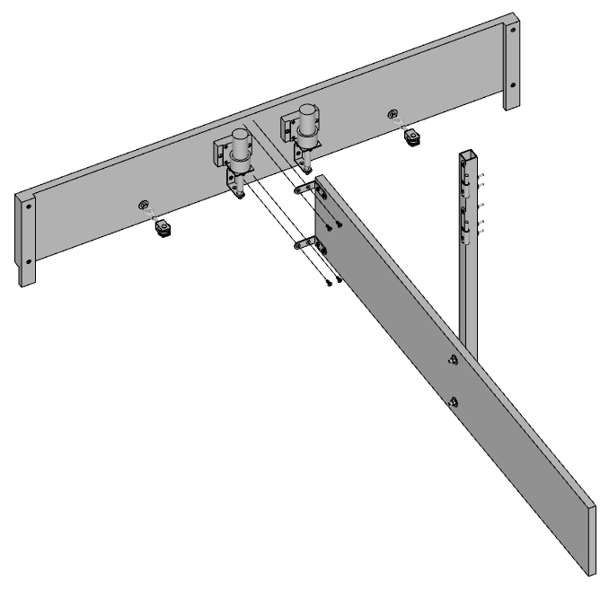](https://remipch.github.io/test_website/view_3d.html?model=temp)

A 'stand' consists of the following parts:

| Count | Description |
| ----- | ----------- |
| 1 | [Stand back board](#stand-back-board)
| 1 | [Stand front board](#stand-front-board)
| 4 | Wood screw D4mm L15mm

#### Stand back board

| Assembled | Exploded |
| --------- | -------- |
| [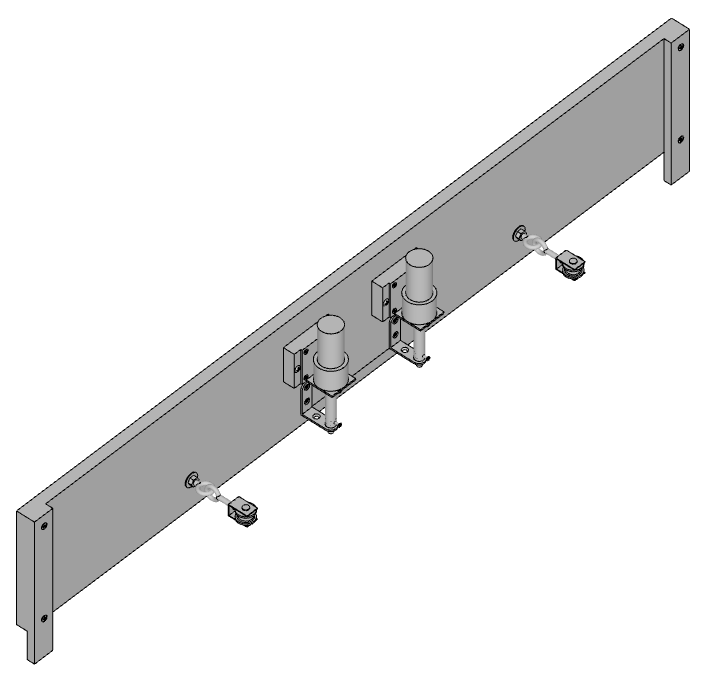](https://remipch.github.io/test_website/view_3d.html?model=temp) | [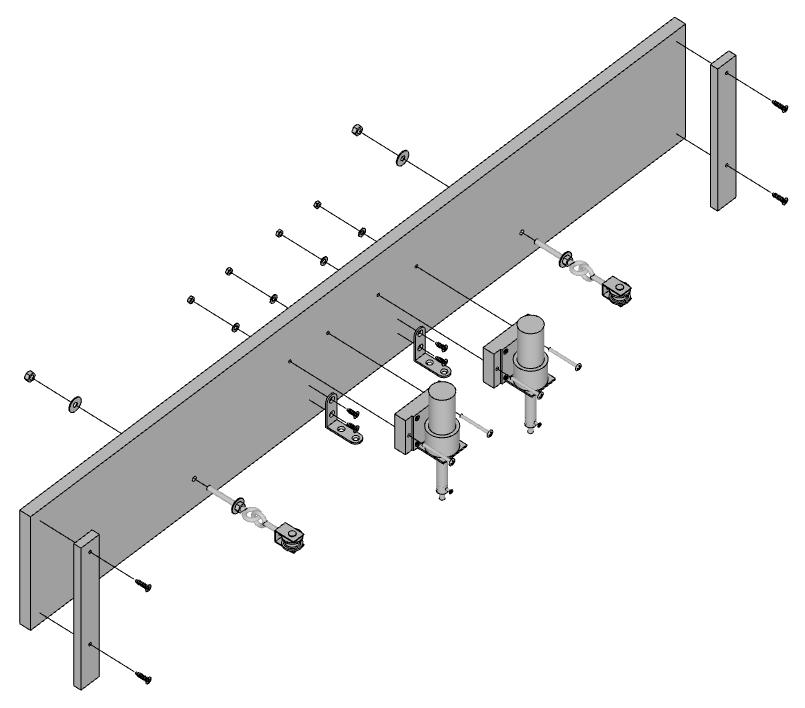](https://remipch.github.io/test_website/view_3d.html?model=temp)

A 'stand back board' consists of the following parts:

| Count | Description |
| ----- | ----------- |
| 2 | [Motor block](#motor-block)
| 1 | Wood board W1000mm D15mm H160mm
| 2 | Wood leg W28mm D10mm H200mm
| 2 | [Pulley](https://www.leroymerlin.fr/produits/quincaillerie/corde-sangle-sandow-chaine-cable/accessoires-de-corde-de-cable-de-chaine/poulie-a-piton-acier-zingue-standers-diam-20-x-l-97-x-l-20-mm-70627375.html) with washer and nut
| 2 | Small bracket
| 4 | Wood screw D4mm L15mm
| 4 | Wood screw D4mm L20mm
| 4 | Round head bolt M4 L40mm with washer and nut

##### Motor block

| Assembled | Exploded |
| --------- | -------- |
| [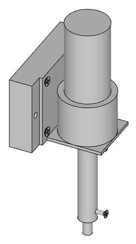](https://remipch.github.io/test_website/view_3d.html?model=temp) | [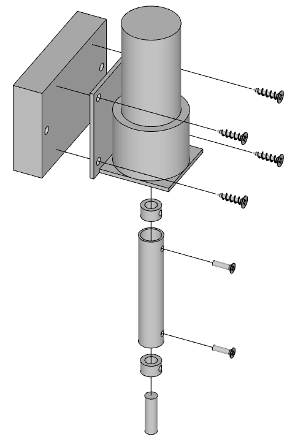](https://remipch.github.io/test_website/view_3d.html?model=temp)

A 'motor block' consists of the following parts:

| Count | Description |
| ----- | ----------- |
| 1 | [Model engine](https://www.gotronic.fr/art-motoreducteur-mfa-950d8101ln-11376.htm)
| 1 | [Engine bracket](https://www.gotronic.fr/art-support-pour-motoreducteurs-mfa-727-22944.htm)
| 1 | Wood board W68mm D15mm H48mm
| 2 | [Locking ring](https://www.conrad.fr/fr/p/bagues-d-arret-modelcraft-10347-6-mm-225436.html) d6mm D10mm L5mm
| 2 | Countersunk bolt M3 L14mm
| 1 | Cylindrical steel tube L60mm d10mm D12mm
| 1 | Cylindrical steel rod L20mm D6mm
| 4 | Wood screw D3mm L15mm

#### Stand front board

| Assembled | Exploded |
| --------- | -------- |
| [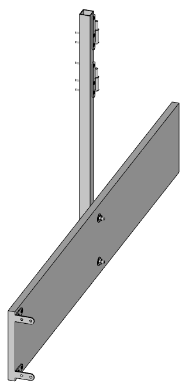](https://remipch.github.io/test_website/view_3d.html?model=temp) | [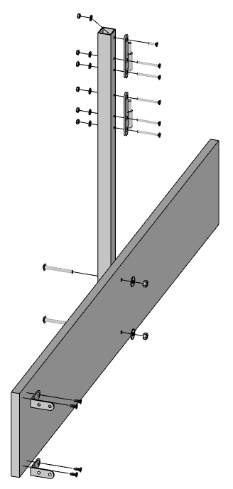](https://remipch.github.io/test_website/view_3d.html?model=temp)

A 'stand front board' consists of the following parts:

| Count | Description |
| ----- | ----------- |
| 2 | [Left hinge](https://www.bricomarche.com/p/paumelle-bois-bout-rond-80x40mm-gauche-zingue/3479045300500) male
| 1 | Aluminium square tube W23.5mm L600mm
| 2 | Small bracket
| 1 | Countersunk bolt M4 L15mm with washer and nut
| 5 | Countersunk bolt M4 L40mm with washer and nut
| 2 | Round head bolt M6 L50mm with washer and nut
| 4 | Wood screw D4mm L15mm

### Panel frame

| Assembled | Exploded |
| --------- | -------- |
| [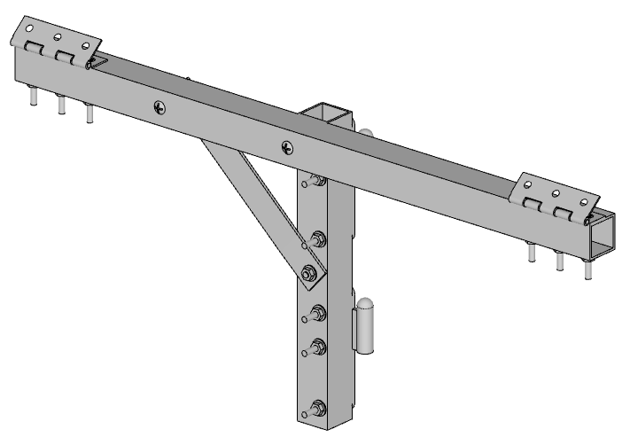](https://remipch.github.io/test_website/view_3d.html?model=temp) | [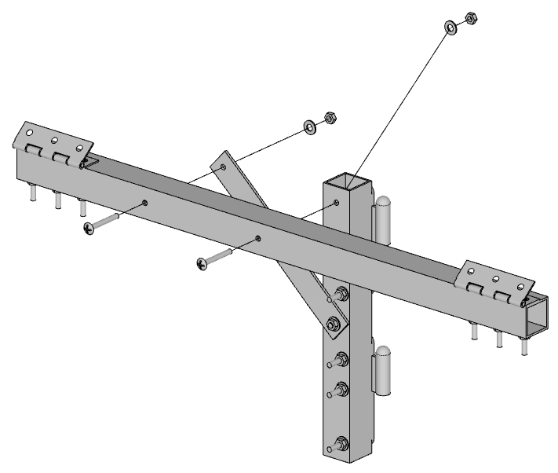](https://remipch.github.io/test_website/view_3d.html?model=temp)

A 'panel frame' consists of the following parts:

| Count | Description |
| ----- | ----------- |
| 1 | [Panel horizontal axis](#panel-horizontal-axis)
| 1 | [Panel vertical axis](#panel-vertical-axis)
| 2 | Round head bolt M4 L30mm with washer and nut

#### Panel horizontal axis

| Assembled | Exploded |
| --------- | -------- |
| [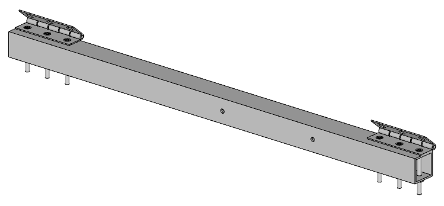](https://remipch.github.io/test_website/view_3d.html?model=temp) | [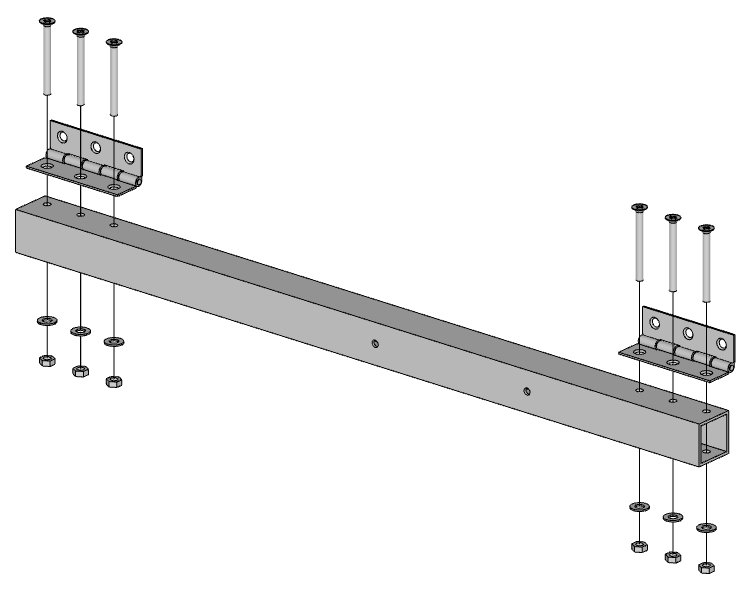](https://remipch.github.io/test_website/view_3d.html?model=temp)

A 'panel horizontal axis' consists of the following parts:

| Count | Description |
| ----- | ----------- |
| 1 | Aluminium square tube W23.5mm L450mm
| 6 | Countersunk bolt M4 L40mm with washer and nut
| 2 | Small hinge

#### Panel vertical axis

| Assembled | Exploded |
| --------- | -------- |
| [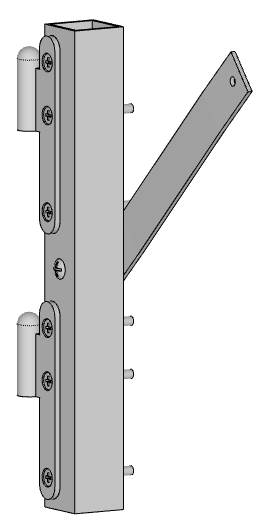](https://remipch.github.io/test_website/view_3d.html?model=temp) | [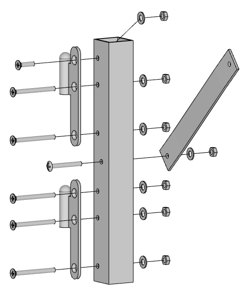](https://remipch.github.io/test_website/view_3d.html?model=temp)

A 'panel vertical axis' consists of the following parts:

| Count | Description |
| ----- | ----------- |
| 2 | [Left hinge](https://www.bricomarche.com/p/paumelle-bois-bout-rond-80x40mm-gauche-zingue/3479045300500) female
| 1 | Aluminium square tube W23.5mm L200mm
| 1 | Aluminium flat profile W20mm D2mm
| 1 | Countersunk bolt M4 L15mm with washer and nut
| 5 | Countersunk bolt M4 L40mm with washer and nut
| 2 | Round head bolt M4 L30mm with washer and nut

### Panel board

| Assembled | Exploded |
| --------- | -------- |
| [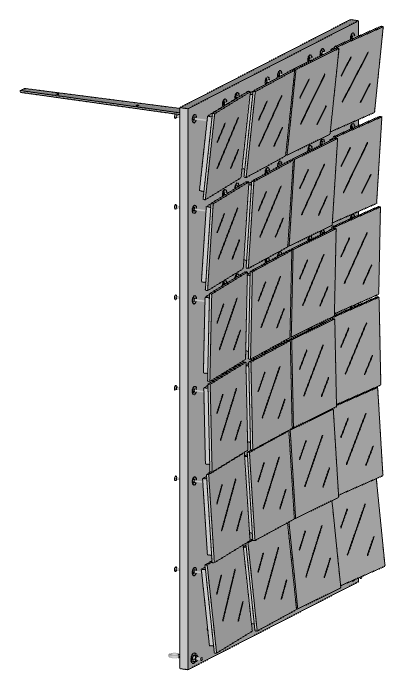](https://remipch.github.io/test_website/view_3d.html?model=temp) | [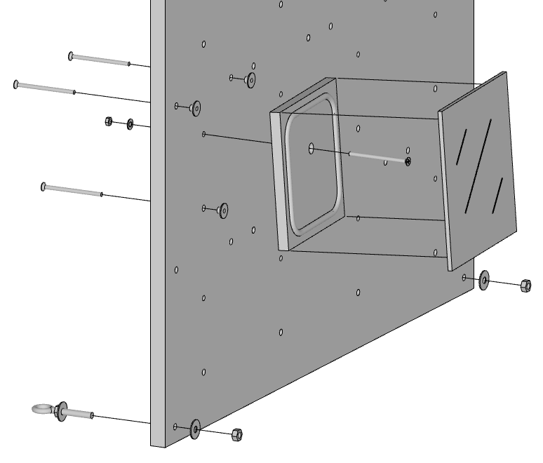](https://remipch.github.io/test_website/view_3d.html?model=temp)

A 'panel board' consists of the following parts:

| Count | Description |
| ----- | ----------- |
| 1 | Wood board W620mm D15mm H960mm
| 24 | Wood part W130mm D10mm H130mm
| 1 | [Big bracket](https://www.leroymerlin.fr/produits/rangement-dressing/etagere/fixation-etagere/equerre-etagere/equerre-normo-acier-peint-blanc-h-45-x-p-40-cm-85002102.html)
| 24 | [Mirror](https://www.bricoman.fr/lot-6-miroirs-adhesif-carre-15x15-cm-1429043.html)
| 1 | [Mirror glue](https://www.leroymerlin.fr/produits/decoration-eclairage/dalle-rosace-et-moulure/colle-dalle-rosace-et-moulure/colle-de-fixation-ms-polymere-verre-et-miroir-pattex-300g-transparent-69639934.html)
| 72 | [Impact nut](https://www.vis-express.fr/ecrou-a-griffes/31277-1004768-ecrou-a-griffes-m4-acier-zing-blanc-3663072090095.html)
| 96 | Countersunk bolt M4 L60mm
| 24 | M4 washer and nut
| 2 | Fixed ring with washer and nut
| 3 | Wood screw D4mm L15mm

## License

Copyright (C) 2024 Rémi Peuchot

This folder is distributed under [Creative Commons Attribution-NonCommercial-ShareAlike 4.0](mechanics/LICENSE.md)
