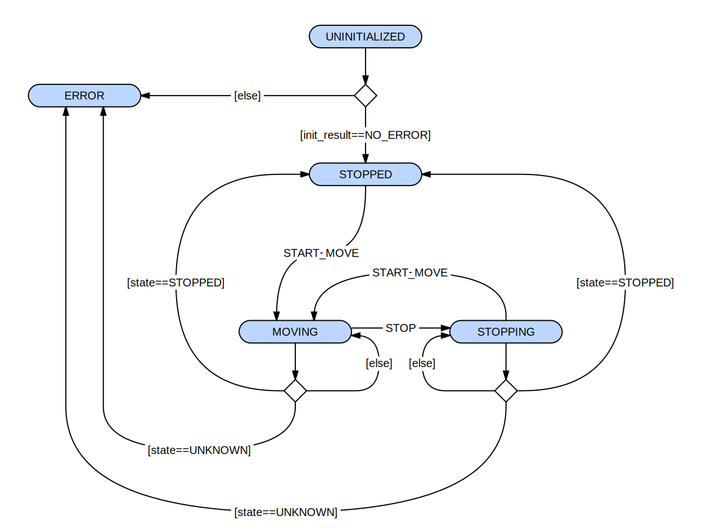

# Motors component

This component allows to control the motors from the ESP32 application.

It sends commands to the external motors_controller board via serial pins, read the reply
and manages the current motors state.

It's split into a few files :

`motors` is the public interface of the motors component.

It wraps `motors_state_machine` under esp32 specific tools
(task, thread safety, event, signals, etc.).

It shoud not implement any logic by itself.

`motors_state_machine` is the core logic implementation of the component.

Splitting `motors_state_machine` from esp32 ecosystem allows to test
the core logic of this component :
- independently from esp32 ecosystem
- in simple, reproducible, single-threaded unit tests
- executed on host for rapid validation and feedback

`motors_state_machine` is not thread-safe by itself, its function must
never been called simultaneously.

`motors_hw` contains the minimal code to wrap
`motors_state_machine` "high level" decisions to specific hardware details.
It internally defines the gpio pins to use and the various hardware configs.

`motors_direction` declares public data structures of the motors component.

The following diagram is a slightly simplified representation of `motors_state_machine` :

