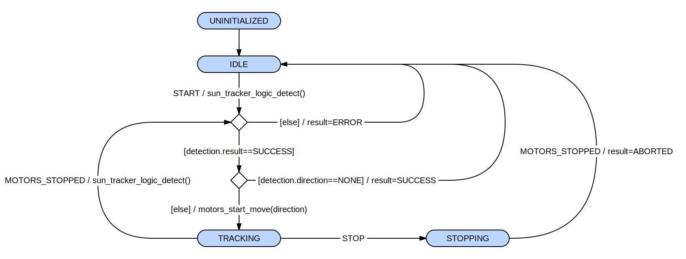

# sun_tracker

The sun_tracker component goal is to keep the sun light at the center of the target area.

Its main steps are :
- use camera to capture image
- use target_detector to detect the target area (where the spot light must be kept)
- use its own logic to detect the spot light and
deduce the eventual move direction to get closer to the target area center
- use motors to start move in the previously deduced direction
- listen motors to know when the move is finished

Its implementation is split in 3 layers :
- `sun_tracker` is the public interface of the component. It hides the internal synchronisation details
(mutex, tasks, etc.) and provide a minimal set of functions to use the component.
It does not implement logic by itself but provides thread safety to `sun_tracker_state_machine` layer.
- `sun_tracker_state_machine` manages the current state and react to external or internal transitions.
- `sun_tracker_logic` implements the component logic itself.

This separation allows to develop and test the state_machine and logic independently from the specific
platform (thread, mutex, synchronisation, etc.). These tests can be launched from host (see tests_on_host subfolder).

The following diagram is a slightly simplified representation of `sun_tracker_state_machine` :

