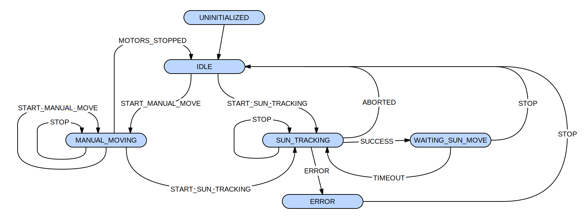

# Supervisor component

This component implements the high level logic of the ESP32 application.

The `web_interface` component calls its minimal set of functions to react to user actions.

The following diagram is a slightly simplified representation of its internal state machine :

