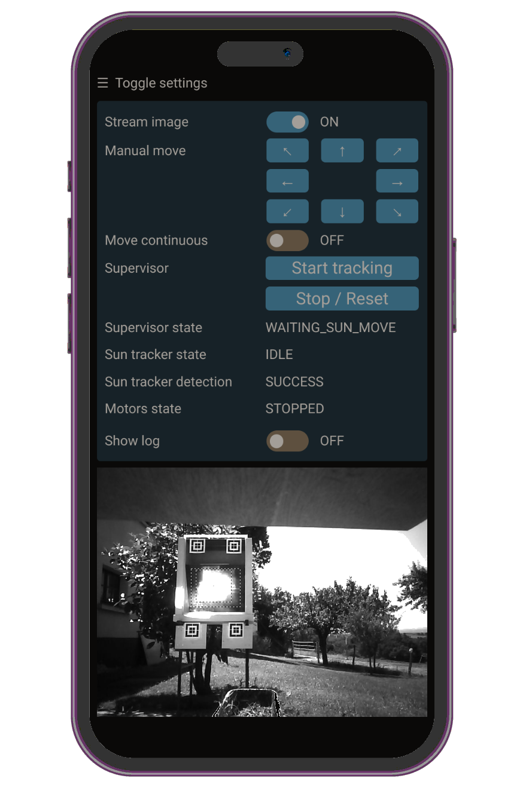

# Web interface component

This component provides a minimal http server serving a single web page
to control the supervisor.

It has been started from esp32 `web_custom` example and iteratively changed
to bring supervisor features.

Note: the web page is designed for smartphone only
(it works on larger screen but it's not optimal).

Here is a screenshot of the resulting web page :

